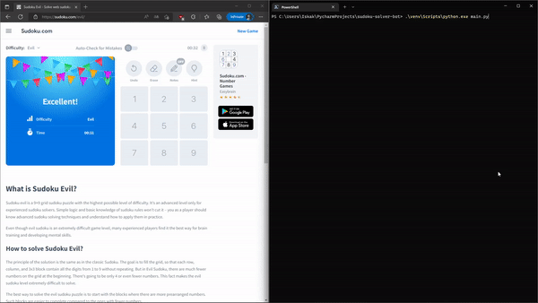

# sudoku-solver-bot

### Tested only with Python 3.10.7
1. Get python 3.10.7
2. Install requirements `pip install -r .\requirements.txt`
3. Run with `python .\main.py`
   1. Move mouse to the **top left** of the board and press `q`
   2. Move mouse to the **bottom right** of the board and press `w`
   3. Press `e` to start the bot

You can train NN: `python .\train.py` \
Trained with [Chars74K](http://www.ee.surrey.ac.uk/CVSSP/demos/chars74k/) 
\ [EnglishFnt.tgz](http://www.ee.surrey.ac.uk/CVSSP/demos/chars74k/EnglishFnt.tgz)
(only digits)
which is `.\digits` folder

